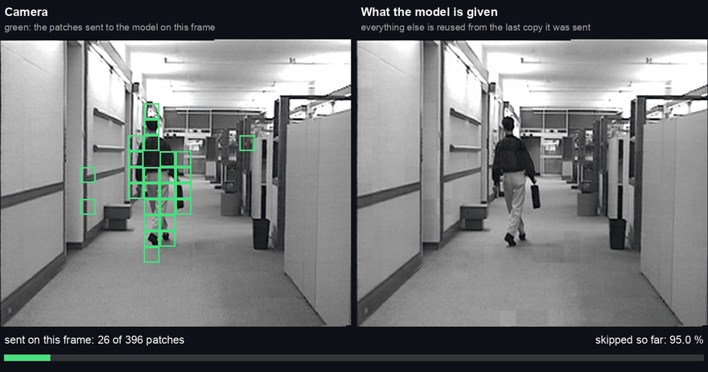
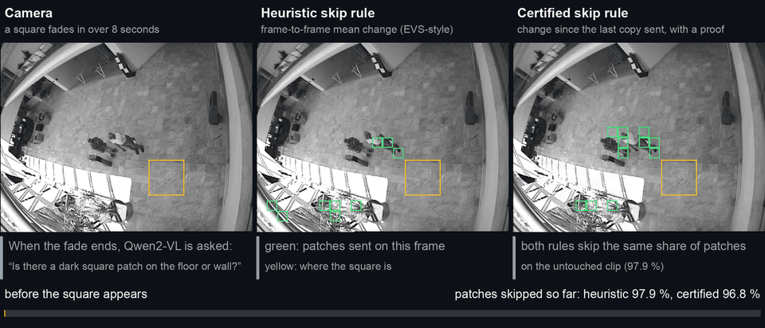
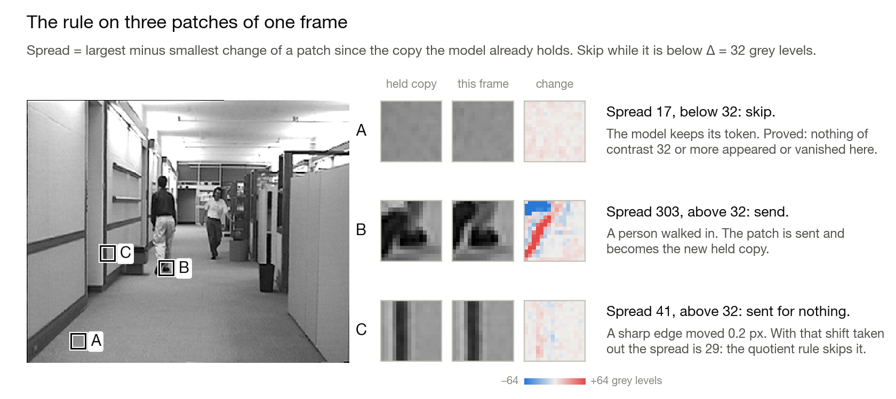
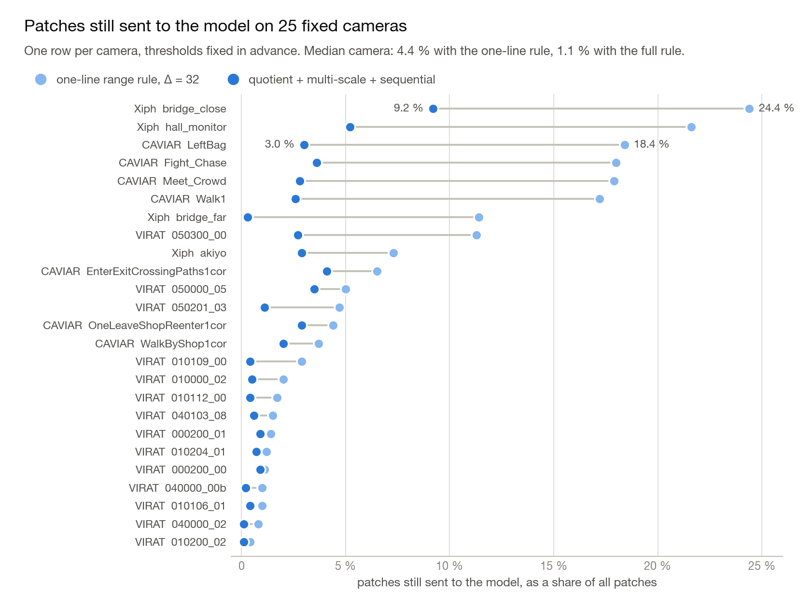
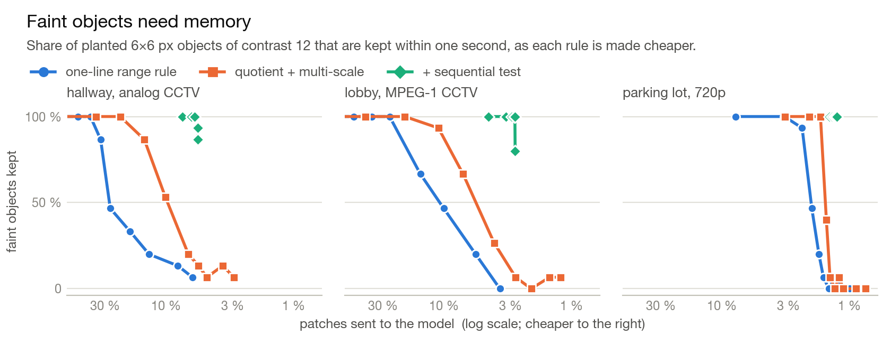
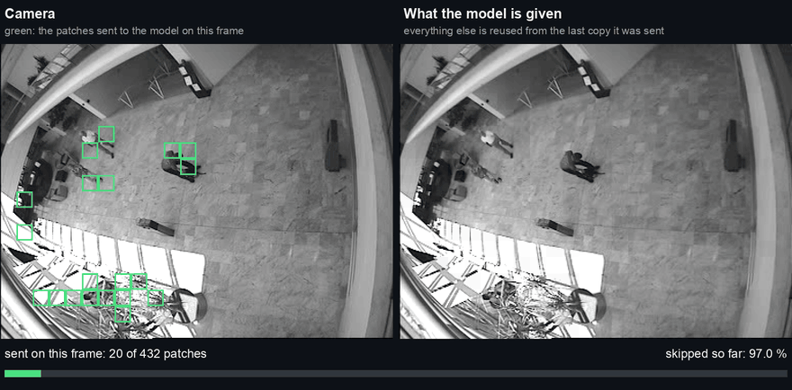
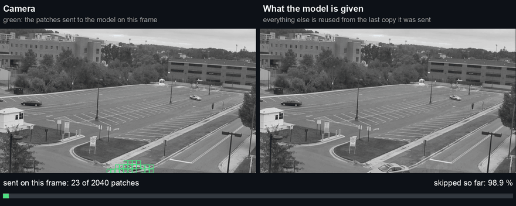
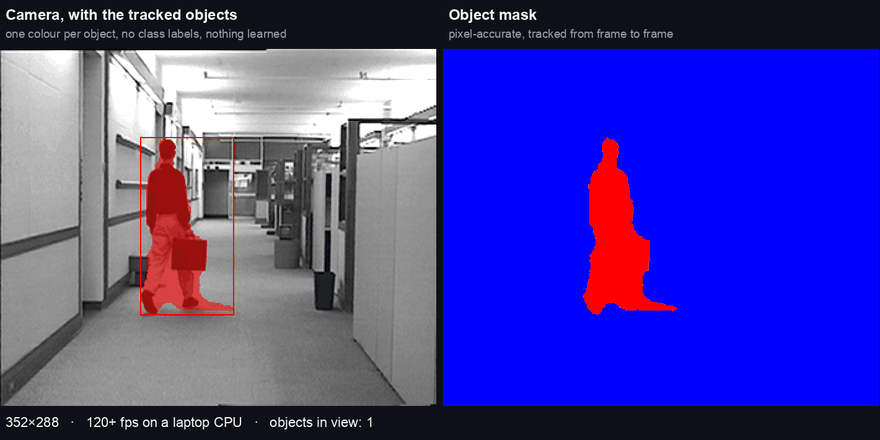
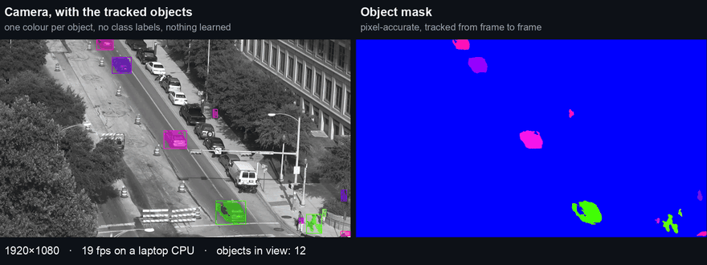

<h1 align="center">Certified Skip</h1>

<p align="center">
  <b>Skip the video patches that did not change, with a proof of what cannot have been missed.</b>
</p>

<p align="center">
  <a href="https://github.com/nsquaredzz/certified-skip/actions/workflows/tests.yml"></a>
  <a href="LICENSE"></a>
  
  
  <a href="https://nsquaredzz.github.io/blog/certified-skip/"></a>
</p>

<p align="center">
  <a href="assets/skip_hallway.mp4"></a>
</p>

<p align="center"><sub>
An office hallway camera. Left: the frame, with the patches that are sent to the model outlined in green.<br>
Right: the picture the model is left with when every other patch is reused from the last copy it was sent.<br>
On this clip 95 % of the patches are never sent. Every clip on this page links to its full-quality MP4.
</sub></p>

## What this is

A vision transformer turns every 16×16 patch of every frame into a token. On a fixed camera nearly all of those patches show the same wall and floor as a second ago, so video language models try to skip the ones that did not change. The rules in use are heuristics, typically the mean change of a patch between consecutive frames. They are cheap, they work most of the time, and they say nothing about what was thrown away.

Certified Skip replaces the heuristic with a rule that fits on one line and comes with a theorem:

> **Skip a patch while the spread of its change since the last copy sent stays below a contrast level Δ.**
> The spread is the largest minus the smallest change over the pixels of the patch.

While a patch is skipped, nothing of contrast Δ or more can have appeared in it or vanished from it. "Nothing" has a precise meaning: every dark or bright blob of the patch, in the sense of persistent homology, keeps its contrast to within the spread. The proof is two lines on top of the 2007 stability theorem for persistence diagrams, and a matching construction shows that the threshold cannot be raised.

The rest of the repository is what happened when that rule met real cameras: where it broke, three further certificates built to fix it, a sequential test for objects too faint for any single frame, pixel-accurate object masks at video rate from the same machinery, two ideas that did not work, and an end-to-end check with an unmodified video language model.

Everything is implemented twice, as a header-only C++17 core and as a numpy reference that must agree with it decision for decision, with 51 tests that check the theorems on data.

**Read next:** [the write-up](https://nsquaredzz.github.io/blog/certified-skip/) for the full argument, [THEORY.md](THEORY.md) for statements and proofs, [RESULTS.md](RESULTS.md) for every number.

## Results at a glance

| Question | Measured | Details |
|---|---|---|
| How much is skipped? | **98.9 %** of patches on the median camera, 90.8 % on the worst, over 25 fixed-camera clips | [Part VI](RESULTS.md#part-vi--breadth-25-fixed-camera-clips-2026-10-08-last) |
| Is anything lost? | Planted 5×5 px and 3×3 px objects: all kept on all 25 clips. Slow fades: 249 of 250 kept | [Part VI](RESULTS.md#part-vi--breadth-25-fixed-camera-clips-2026-10-08-last) |
| What about faint objects? | 6×6 px objects of contrast 12: **96 %** kept with the sequential test, 13 % without, for 0.1 points of skip rate on the median clip | [Part III](RESULTS.md#part-iii--the-time-axis-sequential-quickest-detection-rule-2026-10-08-later-still), [Part VI](RESULTS.md#part-vi--breadth-25-fixed-camera-clips-2026-10-08-last) |
| Does a model notice? | A slowly appearing object reaches the model in **48 of 48** trials, against 6 of 48 for the consecutive-frame heuristic at the same skip rate | [Part VII](RESULTS.md#part-vii--end-to-end-with-a-real-video-llm-2026-10-08-last) |
| How fast? | Full rule in C++, one thread: 467 fps at 352×288, 89 fps at 1280×720. Mask tracker: 19 to 25 fps at 1920×1080 | [Part III](RESULTS.md#soundness-and-speed), [Part IV](RESULTS.md#part-iv--pixel-accurate-object-masks-at-video-rate-2026-10-08-last) |

All numbers are from an Apple M4 laptop, on public footage, with the scripts in this repository.

## The blind spot a heuristic cannot close

<p align="center">
  <a href="assets/blindspot_lobby.mp4"></a>
</p>

A square fades in over eight seconds on a real lobby camera, at 0.35 grey levels per frame. Both rules were set to skip the same share of patches on the untouched clip, 97.9 %.

The heuristic compares each frame with the one before it. No single step is ever large enough, so the patch is never refreshed, however dark the square becomes. The certified rule compares with the last copy that was *sent*, so the change accumulates and the patch is refreshed as soon as it reaches the threshold. This is the theorem at work, and it holds for every skipped patch, on every frame.

The same experiment, with an unmodified Qwen2-VL-2B asked whether it sees the square at the end of the fade:

| 48 trials on three cameras | Consecutive-frame heuristic | Certified skip | Certified + sequential |
|---|---|---|---|
| The square is present in what the model is shown | 6 of 48 | **48 of 48** | **48 of 48** |
| The model answers yes, in the 26 trials where it can see the square in the full frame | 2 of 26 | **23 of 26** | **24 of 26** |

On the matching frame without the square, the model answered yes in 0 of 48 trials.

On ordinary footage, with nothing planted, the lobby camera shows a second effect. The heuristic leaves smeared copies of walking people behind, and the model's people count then matches its own full-frame count on 7 of 15 frames. With the certified view it matches on 14 of 15. On the hallway and the parking lot all rules agree with the full frame equally.

Read this for what it is. The model has 2 billion parameters and runs on a laptop. The objects are synthetic squares, which the model can see in only 26 of the 48 full frames. The model is shown the *view* a rule leaves, which measures the information in the pruning decisions, not token reuse inside the model. The heuristic is the consecutive-frame criterion that EVS-style pruning and run-length tokenisation are built on, re-implemented and calibrated to the same skip rate. It is not any published system's full pipeline. The first row of the table needs none of those caveats.

The parking-lot trial is in [assets/blindspot_parking.mp4](assets/blindspot_parking.mp4).

## How the rule works

<picture>
  <source media="(prefers-color-scheme: dark)" srcset="assets/fig_rule_dark.png">
  
</picture>

For each patch keep `R`, the last copy that was sent to the model. On a new frame `F`:

```python
d      = F - R                  # change since the copy the model holds
spread = d.max() - d.min()
if spread < delta:              # skip: the model reuses its token
    pass
else:                           # send: this patch becomes the new R
    R = F
```

**Guarantee.** With `c` the midpoint of the change, the frame is within half the spread of the held copy shifted in brightness, and stability of persistence diagrams (Cohen-Steiner, Edelsbrunner, Harer 2007) carries that bound over to the topology:

```math
\lVert F - (R + c) \rVert_\infty \;\le\; \tfrac{1}{2}\,\mathrm{spread} \;<\; \tfrac{\Delta}{2}
\qquad\Longrightarrow\qquad
d_B\big(\mathrm{Dgm}\,F,\ \mathrm{Dgm}\,(R + c)\big) \;<\; \tfrac{\Delta}{2}
```

So every blob changes contrast by less than the spread, and no blob of contrast Δ or more is born or dies while the patch is skipped. A uniform change of brightness has spread zero and is skipped, which is correct: topologically nothing happened.

**Tightness.** For any change pattern with spread Δ there is a scene, a flat patch, in which that change creates an object of contrast exactly Δ. No rule that looks only at the change can skip at spread Δ or above and keep the guarantee.

**Checked on data.** The tests compute exact persistence diagrams and bottleneck distances on dropped patches. On real footage 1,300 audited patches gave 0 violations, and the bound is attained exactly, never exceeded.

Patch C is the catch, and the next section is about it.

## From one line to a rule that survives real cameras

On codec-clean surveillance cameras the one-line rule skips 98 to 99 % of patches. On a noisy analog hallway it skips 73 %. The cause is not sensor noise, which the rule tolerates. It is sub-pixel jitter of sharp edges: an edge that moves a fifth of a pixel changes a whole column of pixels by a large amount, and the spread sees it.

Each fix below is a different piece of mathematics with its own theorem, and each was measured by planting objects into real footage and asking for 100 % recall.

| Rule | A skipped patch is certified against | Patches still sent: hallway / lobby / parking lot |
|---|---|---|
| Range, the one-line rule | any feature of contrast Δ | 19.2 % / 15.3 % / 1.6 % |
| Quotient: fit a sub-pixel shift, certify the residual | the same, up to a shift of at most one pixel | 14.1 % / 10.9 % / 1.5 % |
| Multi-scale: box averages on a schedule flatter than 1/size | objects that contain a box of each size, at that size's contrast | 7.5 % / 4.1 % / 1.3 % |
| **Quotient + multi-scale** | both of the above | **5.5 % / 2.7 % / 1.2 %** |
| **+ sequential test** | in addition, statistically: a persistent faint change is sent within a bounded delay | 5.7 % / 2.8 % / 1.3 % |
| Transport, the flat norm | creation, destruction or movement of mass | never reaches 100 % recall on 3×3 px objects |

The last two rows are the interesting ones. The sequential test is a self-normalised space-time scan from quickest change detection. It costs a fraction of a point and sees what no memoryless rule can. The transport certificate was the elegant candidate and it failed for a clear reason: a jittering edge is single-signed mass, so there is nothing for transport to cancel.

<picture>
  <source media="(prefers-color-scheme: dark)" srcset="assets/fig_breadth_dark.png">
  
</picture>

The full table behind this chart, with noise level, real motion and recall per clip, is in [RESULTS.md, Part VI](RESULTS.md#part-vi--breadth-25-fixed-camera-clips-2026-10-08-last). The worst camera looks at a river, whose water really does move.

<picture>
  <source media="(prefers-color-scheme: dark)" srcset="assets/fig_faint_dark.png">
  
</picture>

A memoryless rule cannot see an object fainter than one frame's noise at any useful skip rate. The sequential test learns the null distribution of its own statistic per patch from quiet frames, because real camera noise turned out to be spatially correlated and to drift in time. The textbook Gaussian version fired on 40 to 90 % of static patches and was discarded.

More cameras, same rule:

| Lobby, MPEG-1 CCTV: 97.9 % skipped | Parking lot: 99.6 % skipped |
|---|---|
| <a href="assets/skip_lobby.mp4"></a> | <a href="assets/skip_parking.mp4"></a> |

## Object masks at video rate

<p align="center">
  <a href="assets/masks_hallway.mp4"></a>
</p>
<p align="center">
  <a href="assets/masks_street.mp4"></a>
</p>

The skip rule decides per patch. The same change statistic, taken to the pixel, gives class-agnostic object masks, with nothing learned.

- **One frame** is a Potts model, solved exactly through its convex total-variation relaxation (Chan, Esedoğlu, Nikolova 2006).
- **A video** is a time-varying convex program. Its minimiser is *tracked*: predicted from each object's velocity, then corrected with three primal-dual steps on the patches that the skip statistic marks as active. At 1080p that is between one pixel in ten and one in twenty.
- **The labels that are reused** carry a certificate too: the KKT residual of the current energy stays below a tolerance on the frozen region, on every frame.

| Clip | Resolution | Pixels touched | Speed |
|---|---|---|---|
| Hallway | 352×288 | 49 % | 140 to 151 fps |
| Parking lot | 1280×720 | 4.6 % | 29 fps |
| Building forecourt | 1920×1080 | 5.0 % | 24 to 29 fps |
| Street with foliage | 1920×1080 | 9.5 % | 18 to 19 fps |

Against the fully converged per-frame solution the tracked mask has mean IoU 0.94. The quality is that of a good classical pipeline, not of a learned segmenter. A grey coat on a grey wall thins the silhouette, people who enter already touching share one identity until they part, and a person who stands still through initialisation is background. [RESULTS.md, Part IV](RESULTS.md#part-iv--pixel-accurate-object-masks-at-video-rate-2026-10-08-last) lists the failures as carefully as the successes. A third clip is in [assets/masks_forecourt.mp4](assets/masks_forecourt.mp4).

## What did not work

Negative results are part of the record here, each with its reason.

- **Transport certificate.** Sound, cheap, and no better than a mean rule on edge jitter. Kept as a baseline. [THEORY §1](THEORY.md#1-transport-certificate-flat-norm)
- **Predictive look scheduling.** A scheduler that decides when to look, with a distribution-free bound on its miss rate. The bound held in 12 of 12 runs, and the scheduler did not beat uniform sampling at equal cost. Proposition 10 says why: onsets on these cameras are nearly unpredictable from recent activity, and for memoryless onsets uniform spacing is optimal. [THEORY §8](THEORY.md#8-predictive-look-scheduling-with-a-distribution-free-guarantee-and-why-it-does-not-beat-uniform-sampling)
- **Moving cameras.** On a film with cuts and camera motion the rule skips 37 % at 2 fps and 58 % at 24 fps. The certificate is for fixed cameras. The quotient construction extends to homographies on paper, and none of that is implemented.
- **The first sequential test.** Parametric Gaussian thresholds fired on 40 to 90 % of static patches on all three cameras. Self-normalisation fixed it, and two more guards were needed for codec keyframe breathing.

## Quick start

Requirements: a C++17 compiler, Python 3.10 or newer, and `ffmpeg` with `ffprobe` on the path for anything that reads video. Tested on macOS (Apple Silicon) and Linux (x86-64 and ARM64).

```bash
git clone https://github.com/nsquaredzz/certified-skip.git
cd certified-skip
python3 -m pip install -r requirements.txt
make -C cpp
python3 -m pytest tests -q
```

That builds the shared library and the command-line tool, and runs the 51 tests. Then fetch three public cameras, 135 MB, and watch the rule work on one:

```bash
python3 scripts/fetch_data.py
python3 scripts/render_overlay.py data/hall_monitor_cif.y4m out/hallway.mp4 --fps 30 --rule sequential --delta 8 --upscale 2
```

### Python

```python
import sys; sys.path.insert(0, "python")
import certskip as cs
from certskip.native import NativeSequentialPruner

frames = cs.video.iter_gray("data/hall_monitor_cif.y4m", fps=30)   # (H, W) uint8 frames

# The one-line rule. C++ if the library is built, numpy otherwise.
rule = cs.make_pruner(height=288, width=352, patch=16, delta=32)

# The rule the results recommend: quotient + multi-scale + sequential.
schedule = {r: 80.0 * (2 * r + 1) ** -0.5 for r in (0, 1, 2, 3)}    # contrast threshold per box half-width
rule = NativeSequentialPruner(288, 352, 16, multiscale=schedule, z=8.0)

for frame in frames:
    keep, score, shift = rule.step(frame)   # keep: (18, 22) bool, True where the patch must be sent
    view = rule.view()                      # what the model is left with, as an image
```

`keep` is the only thing a model integration needs: send the patches where it is true, reuse the tokens of the rest.

### C++

The core is one header, [cpp/certskip.hpp](cpp/certskip.hpp). The command-line tool reads raw grey frames on standard input and prints one line per frame:

```bash
ffmpeg -v error -i cam.mp4 -vf fps=2,format=gray -f rawvideo - | ./cpp/certskip -w 1920 -h 1080 -p 16 -d 32
```

### Your own camera

```bash
python3 scripts/analyze_footage.py cam.mp4 --fps 2 --scale 1280x720 --deltas 16,24,32,48 --audit 500
python3 scripts/render_segmentation.py cam.mp4 masks.mp4 --fps 25 --native
```

The first reports the camera's temporal noise, the skip rate at each Δ against the Gaussian ceiling, codec keyframe spikes, the baselines matched to the same skip rate, and a soundness audit. The second writes the mask video.

## Reproduce the numbers

`python3 scripts/fetch_data.py all` downloads the 25 benchmark clips, 1.4 GB, from their owners' servers and checks each against a recorded SHA-256. Nothing is redistributed here. Unless a comment says otherwise, the three clips of the quick start are enough.

```bash
# Part I: real footage, and the synthetic benchmark (needs no footage)
python3 scripts/analyze_footage.py data/hall_monitor_cif.y4m --fps 30 --audit 500
python3 scripts/synthetic_bench.py --scenes 3 --seconds 40 --small-trials 64 --slow-trials 64

# Part II: the four certificates.  Part III: the sequential test
python3 scripts/real_bench.py --clips hall,leftbag,virat --out out/real_bench
python3 scripts/real_bench.py --clips hall,leftbag,virat --rules "range,quotient+ms g=.5,sequential z (ms80)" --out out/real_bench_seq

# Part IV: masks
python3 scripts/render_segmentation.py data/hall_monitor_cif.y4m out/masks_hall.mp4 --fps 30 --native --upscale 2

# Part V: look scheduling.  Part VI: the 25 clips.  Both need `fetch_data.py all`
python3 scripts/sampling_bench.py --decay 0.5 --out out/sampling_bench
python3 scripts/breadth_bench.py --max-frames 600 --out out/breadth

# Part VII: the language model, answer agreement and then the blind spot
python scripts/e2e_vlm.py --trials 12 --e2-frames 15 --out out/e2e
python scripts/e2e_vlm.py --trials 16 --skip-e2 --out out/e2e_e1b

# The media on this page (needs `fetch_data.py all`)
python3 scripts/make_readme_media.py
python3 scripts/make_readme_figures.py
```

Part VII needs `pip install -r requirements-e2e.txt` in a virtual environment and downloads Qwen2-VL-2B, about 4.5 GB. It took 2.3 s per query on Apple MPS.

The outputs of the reported runs are tracked in [out/](out): JSON, logs and plots. Videos are not tracked. The GIFs on this page are compressed previews, and the MP4 next to each one in [assets/](assets) is the exact render.

## Repository layout

```
cpp/
  certskip.hpp        header-only core: range, quotient, multi-scale and sequential rules
  rtseg.hpp           real-time mask tracker
  certskip.cpp        C ABI for the Python bindings
  main.cpp            command-line tool
python/certskip/
  core.py             numpy reference of the range rule
  warp.py             quotient certificate
  scalespace.py       multi-scale certificate
  flatnorm.py         transport certificate
  sequential.py       sequential test
  segment.py          masks: per-frame solve and real-time tracker
  sampler.py          look scheduling with a distribution-free guarantee
  topology.py         persistence diagrams, exact bottleneck distance, soundness audit
  baselines.py        consecutive-frame mean, mean against last kept, uniform, calibration
  noise.py            temporal noise estimate and the Gaussian ceiling
  native.py           ctypes bindings to the C++ library
  video.py            ffmpeg reader and writer
scripts/              one script per experiment, plus fetch_data.py and the two media builders
tests/                51 tests: semantics, C++ parity, every theorem checked on data
THEORY.md             statements and proofs
RESULTS.md            every measurement, in the order the work was done
out/                  JSON, logs and plots of the reported runs
assets/               the media on this page
```

## What is new, what is not, what is missing

**Not new.** The stability theorem is from 2007. Conditional replenishment is from 1969, and motion-compensated prediction with a residual test is every video codec since H.261. Box filtering and scale space are classical. The flat norm is Whitney's. Sequential analysis is from 1954 to 1998. Background subtraction, Potts models, total-variation relaxations, the Chambolle-Pock algorithm and prediction-correction tracking of time-varying convex programs are all standard.

**New, to my knowledge.**

- The certificate: for each skip statistic, a theorem that names exactly what cannot have happened in a skipped patch, and a tightness construction showing that the threshold cannot be moved.
- Quotienting out a motion group, so that stability only pays for what the group cannot explain. This is also the route to moving cameras.
- A skip rule that certifies in both directions. In the worst case, nothing of contrast Δ appeared in a skipped patch. Statistically, a persistent faint change is sent within a provable, near-optimal delay, with the null measured and not assumed.
- Prediction-correction tracking used to make a segmentation energy follow a video, with the active set driven by the certified change statistic and a KKT certificate for the labels that are reused.

**Missing.**

- Moving cameras.
- Night, rain, snow and thermal footage. The public server that hosts the standard benchmark for those was unreachable during this work.
- Token reuse inside a model. The end-to-end test measures the information in the view, not latency or memory in a deployed model.
- A larger model, and real slow-appearing objects in place of synthetic squares.
- Colour. Every rule here runs on luma.

## Citing

```bibtex
@misc{nair2026certifiedskip,
  author = {Niyath Nair},
  title  = {Certified patch skipping for fixed-camera video},
  year   = {2026},
  url    = {https://nsquaredzz.github.io/blog/certified-skip/},
  note   = {Code: https://github.com/nsquaredzz/certified-skip}
}
```

## Footage and acknowledgements

The clips shown on this page are short excerpts of public research footage, used to show results. They remain under their owners' terms and are not covered by this repository's licence.

- **Xiph.org Video Test Media** (derf's collection): hall_monitor, akiyo, bridge_close, bridge_far.
- **CAVIAR**: EC funded CAVIAR project, IST 2001 37540, INRIA and the University of Edinburgh.
- **VIRAT Video Dataset**, public release hosted by Kitware. S. Oh et al., *A large-scale benchmark dataset for event recognition in surveillance video*, CVPR 2011.
- **Tears of Steel**, © Blender Foundation, CC BY 3.0, used only for the moving-camera limit.
- **Qwen2-VL**, P. Wang et al., 2024, the model of the end-to-end test.

## Licence

The code and the notes are released under the [MIT licence](LICENSE).
